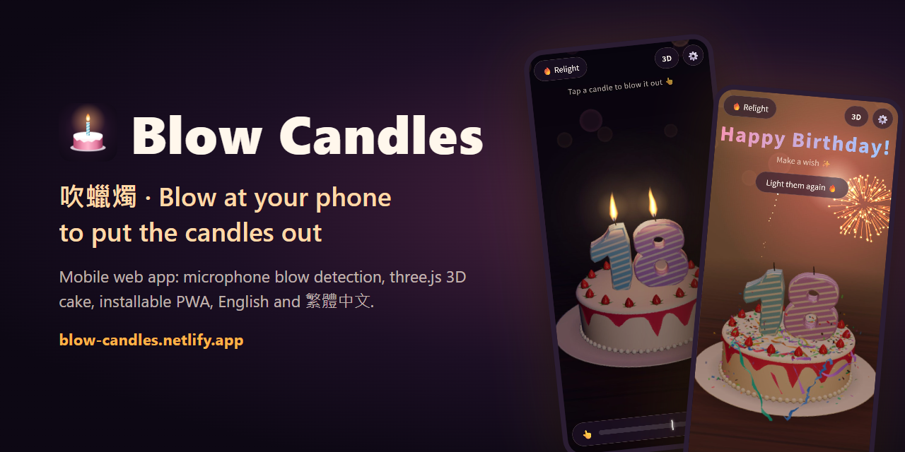

# Blow Candles

**English** | [繁體中文](README.zh-TW.md)

A free online birthday cake for your phone's browser: blow into the microphone and the birthday candles go out. There's no app to download, though it can be installed like one.

**Live demo:** https://blow-candles.netlify.app/en/ (English) · https://blow-candles.netlify.app/ (繁體中文)

[](https://blow-candles.netlify.app/en/)

The app itself is a single [`index.html`](index.html). Alongside it:

- [`en/index.html`](en/index.html) is the English page, generated from `index.html` by [`tools/build-en.mjs`](tools/build-en.mjs).
- [`manifest.webmanifest`](manifest.webmanifest), [`manifest.en.webmanifest`](manifest.en.webmanifest), [`sw.js`](sw.js), `icons/` and `screenshots/` make it installable.
- [`robots.txt`](robots.txt), [`sitemap.xml`](sitemap.xml) and `social/` are for search engines and link previews.
- [`google7b8777b763256a2e.html`](google7b8777b763256a2e.html) verifies the site in Google Search Console. Don't remove it.

## Features

- **Candles:** number candles by default (up to 4 digits, such as `18` or `2026`), or regular candles (1–40).
- **Cakes:** pick classic, chocolate or strawberry cream in Settings, or choose None to show the candles alone.
- **Real-time 3D view (default):** switch views with the button at the top right, or pick 2D on the start screen before anything loads.
  - Rendered with three.js: a modelled cake and extruded number candles.
  - The light sits in the flames and flickers with them, candles cast shadows, the wax glows warm, and smoke rises after you blow.
  - Built to stay light on phones: a single light at the flames plus soft fill light, no shadow maps or post-processing, and the resolution adjusts itself when frames slow down.
  - Falls back to 2D if 3D isn't supported.
- **2D view:** runs smoothly on any device.
- **Celebration:** when every candle is out:
  - Happy Birthday plays and fireworks go off.
  - Party poppers fire confetti and paper streamers from both sides.
  - After a moment, the room light warms up as if someone switched on a lamp. Relighting brings back the candlelit look.
- **Blow detection:**
  - The page asks the browser for the raw microphone signal, with echo cancellation, noise suppression, automatic gain and voice isolation all off. Phones apply these for calls, and they can remove a steady blow before the page hears it. Settings shows which of them the browser actually turned off.
  - Measures how much louder the sound is than the room, so a quiet bedroom and a noisy restaurant feel the same.
  - Talking and short knocks on the phone are filtered out.
  - Blowing is accumulated over time, so an uneven, gusty blow still works.
- **Threshold:** defaults to 60. Drag the threshold line in Settings to make blowing easier or harder.
- **Auto calibration (if needed):** if blowing doesn't put the candles out, stay quiet for 2 seconds, then blow for 3, and the threshold is set for you.
- **Sound:**
  - A breathy puff with a fading smoke hiss, and a match strike when relighting.
  - All sound is synthesized live in the browser, with no audio files.
- **Installable:** it can be installed like an app and opens full-screen from the home screen, even offline.
  - Chrome, Edge and Samsung Internet offer it themselves: an install icon in the address bar, or a banner on Android. An Install button also appears on the start screen and in Settings.
  - iPhone and iPad have no install prompt, so the start screen and Settings explain how: tap Share, then Add to Home Screen.
- **English and Traditional Chinese:** each language has its own page.
  - https://blow-candles.netlify.app/ is Traditional Chinese and https://blow-candles.netlify.app/en/ is English.
  - The start screen links to the other language. A language picked there or in Settings is remembered and used on both pages.
- **URL parameters:**
  - `?num=25`: number candles showing 25
  - `?count=3`: 3 regular candles
  - `?cake=classic`, `?cake=chocolate`, `?cake=strawberry`: pick the cake
  - `?cake=0`: candles without the cake
  - `?r=2d` / `?r=3d`: open in 2D or 3D
  - `?th=60`: set the blow threshold (5–95)
  - `?lang=en` / `?lang=zh`: show that language for this visit only
  - `?q=0` to `?q=2`: fix the 3D render quality instead of adjusting it automatically
  - `?debug`: show detector readings

## Using and hosting it

Phone browsers only allow the microphone over **HTTPS** (or on `localhost`), so serve the file from an HTTPS host such as Netlify or GitHub Pages. Opening the file directly from storage, or embedding it in another site's iframe (claude.ai, for example), blocks the microphone. In that case, tap a candle to blow it out instead.

To try it locally, run:

```bash
python -m http.server 8765
```

Then open http://localhost:8765/.

The English page is at http://localhost:8765/en/.

After every change to `index.html`, rebuild the English page (needs Node.js 18 or later):

```bash
node tools/build-en.mjs
```

`node tools/build-en.mjs --check` exits with an error if `en/index.html` is out of date.

To host it, upload the whole folder, including `en/`, both manifests, `sw.js`, `icons/`, `screenshots/`, `social/`, `robots.txt`, `sitemap.xml` and the Google verification file. After changing the list of app files, bump `VERSION` in `sw.js`.

The 3D view loads three.js 0.160 from jsDelivr. It needs a network connection and a browser with import map support (iOS Safari 16.4 or later).

Some processing is out of the page's reach. On iPhone, if the Mic Mode in Control Center is set to Voice Isolation, set it back to Standard. Some phones also filter wind noise in the microphone hardware.

## Search engines and link previews

- Each page has its own title, description, canonical address and structured data (JSON-LD), all in its own language.
- `hreflang` links tell search engines that the two pages are the same app in two languages. The English page is the default for other languages.
- Link previews (LINE, Facebook, Threads, X, Discord) show `social/og-zh.jpg` or `social/og-en.jpg`.
- `robots.txt` points to `sitemap.xml`, which lists both pages.

The site is registered in search engines:

- [Google Search Console](https://search.google.com/search-console): a URL-prefix property for `https://blow-candles.netlify.app/`, verified by `google7b8777b763256a2e.html`, with `sitemap.xml` submitted.
- [Bing Webmaster Tools](https://www.bing.com/webmasters): imported from Google Search Console, so it needs no verification file of its own. Bing also finds the sitemap through `robots.txt`; if its Sitemaps page is still empty, submit `https://blow-candles.netlify.app/sitemap.xml` there.

If the site moves to another address, update the address in the `seo:start` block of `index.html`, in `SITE` in `tools/build-en.mjs`, and in `robots.txt` and `sitemap.xml`. Then rebuild the English page.

## Versions

| Version | Date | Changes |
|---|---|---|
| v1.0.0 | 2026-10-07 | 2D view, regular and number candles, microphone blowing, adjustable threshold, synthesized sounds and birthday song |
| v2.0.0 | 2026-10-07 | Softer, breath-like blow-out sound; rebuilt blow detection (room-noise baseline, speech filtering, accumulated blowing); auto calibration |
| v3.0.0 | 2026-10-08 | Real-time 3D rendering (three.js), 3D by default, switchable to 2D |
| v4.2.0 | 2026-10-09 | Default threshold 60; the install dialog shows one Chinese and one English screenshot |
| v4.1.0 | 2026-10-09 | Installable as an app, and opens offline; English page at /en/; search and share metadata, sitemap; each page shows its own language |
| v4.0.0 | 2026-10-08 | Lighter 3D for phones; fireworks, confetti and streamers; warm room light during the celebration; English interface; classic, chocolate and strawberry cream cakes, or no cake; raw microphone signal with the phone's call processing off; threshold 75 and number candles by default; calibration only when needed |

See the commit history for every individual change.

## Tests

[`tests/`](tests/) holds the headless-browser tests used during development. They feed synthesized recordings (blowing, talking, knocking, café noise) into a fake microphone and check that blowing puts the candles out while other sounds don't. They also cover auto calibration and the 3D view. See [`tests/README.md`](tests/README.md) for how to run them.

## License

[MIT](LICENSE)
